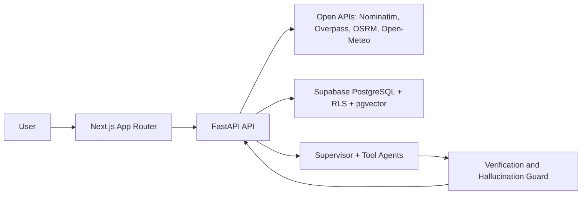
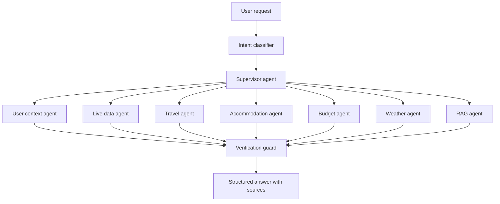

# Architecture

CityMate AI is a monorepo with `apps/web`, `apps/api`, `supabase`, and `docs`.

The backend owns live provider access so browser code does not hit public Nominatim directly. All factual responses use a shared envelope with `sources`, `retrieved_at`, `freshness`, `warnings`, and `unavailable_fields`.

## Agent Workflow

Independent retrieval should run in parallel once LangGraph is connected. The verification guard blocks unsupported factual claims.
